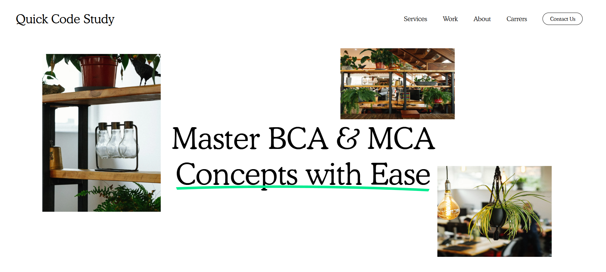

# **Landing Page - Quick Code Study – Learn BCA & MCA**

- Quick Code Study is a Sleek and Modern Educational Landing Page.
- The Site is built using fundamental Web Technologies, Ensuring a Fast and Lightweight Experience for Visitors & 
  this Website is a Single-Page Application that provides a Professional Overview of my Work and a Clear way for Potential Employers or Collaborators to Get in touch.

## Features

- **Crisp Tagline** : “Master BCA & MCA Concepts with Ease”

- Stylish Visual Elements with Educational Tone and Professional Layout

- Navigation bar with Links to

- Contact Us button with Outlined Styling

- Emphasis on typography with Serif fonts and Underlined Hero Text

## Tech Stack

- **HTML5**
 
- **CSS3**

- **JavaScript** (optional) Interactions
 
- **Google Fonts Typography Enhancements**

## Screenshots

Below is a Preview of **Landing Page - Quick Code Study**, Showcasing the Layout and Styling implemented Using pure HTML , CSS and Javascript. 
The Design focuses on Clean Structure, Responsiveness and Modern Styling.

